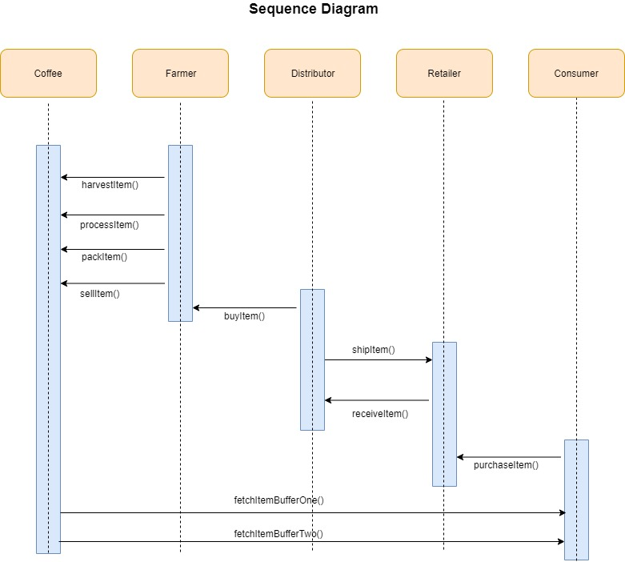

# Blockchain Developer Nanodegree project 3 (Supply chain )
This repository containts an Ethereum DApp that demonstrates a Supply Chain flow between a Seller and Buyer. The user story is similar to any commonly used supply chain process. A Seller can add items to the inventory system stored in the blockchain. A Buyer can purchase such items from the inventory system. Additionally a Seller can mark an item as Shipped, and similarly a Buyer can mark an item as Received.

## Project write-up - UML

### Activity

### Sequence

### State

### Classes (Data Model)

## Project write-up - Libraries
The `Roles` library was used by different access control contracts for easy add and remove in the supply chain
`truffle-hd-wallet-provider` to sign transactions for addresses.

## IPFS
IPFS is not used in this project

## Program Versions numbers
Node: v8.10.0
Solidity: v0.6.10
Truffle: v5.1.29
Web3.js: web3@1.2.1
truffle-hdwallet-provider@1.0.17

##Deployed addresses
 0xb2270f691a1368ee652c6a86c8906788f8daf9996a7b957436fbf5be77511ab2
